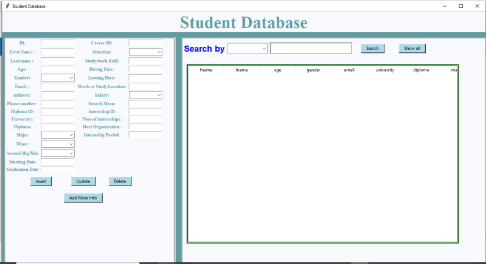
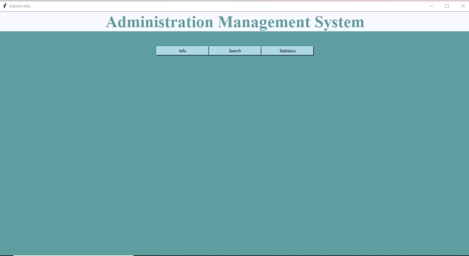

<H1>TBS Jobs Tracking System </H1>
<h2>System Overview and Purpose:</h2>

The TBS Student Management System is a system designed to oversee and maintain student records pertaining to both their university and professional life. 
 
This system is mainly designed to help Tunis Business School's administration 
managing students’ data. Extensive information is available at their 
fingertips through this System.

The system provides:
<ul>
  <li>An Interface designed with tkinter to simplify the process of adding, modifying, and deleting information from the students' database.</li>
  <li>The same interface enables the administration to search for students by specific characteristics as : name, speciality,gender, etc...</li>
  <li>Another interface enabling the administration to get some informative statistics generated by Oracle PL/SQL.</li>
  <li>The system is accompanied by data visualizations using Microsoft Power BI.</li>
</ul>

<h4>System Purpose:</h4>
<ul>
  <li>Manage information about new TBS students. </li>
  <li>Assess TBS student after and before graduation.</li>
  <li>Describes Salaries of TBS students.</li>
  <li>Store old data and old students data.</li>
</ul>

<h2>The process:</h2>
<ol>
  <li>We created our tables to form our database.</li>
  <li>We connected python to oracle database.</li>
  <li>We created two interfaces.</li>
  <li>We used SQL queries and Cursors to pull the following insights:
    <ul>
      <li>Average time students wait before graduation.</li>
      <li>Number of Students hired even before graduation.</li>
      <li>Percentage of students continuing masters studies.</li>
      <li>Percentage of students pursuing their masters degrees in TBS institution.</li>
      <li>percentage of students pursuing their masters degrees In Tunisia But not in TBS.</li>
      <li>Percentage of students pursuing their masters degrees abroad.</li>
      <li>Number of TBSers becoming business Owners.</li>
      <li>Number of students who spent more than 4 years in TBS (4 years bachelor program).</li>
      <li>Number of students working while studying.</li>
      <li>Salaries per major,gender, etc..</li>
      <li>Average waiting time before being hired given number of internships.</li>
      <li>And more...</li>
    </ul>
  </li>
</ol>

